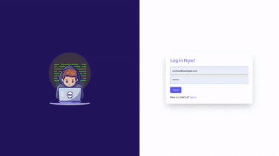

# Coders App challenge

React application using Vite, initialized with TailwindCSS.
Refactoring of the [Web-Pages-Assignment](https://github.com/DarkPix3l/Web-Pages-assignement) exercise.

## Coders Portal

- User authentication and Signin with Redux Toolkit
- Protected routes using react-router-dom
- Authentication using Redux + Async Thunks. It includes a simulated backend verification using createAsyncThunk and handles loading, success, and error states.
- custom input validation rules for the login form to ensure proper user input before dispatching authentication actions.
- Basic dashboard routing after login
- Responsive UI built with Tailwind CSS
- Leaderboard page displaying ranked users with score and solved challenges
- dark/light mode toggle managed via Redux Toolkit wich replaces the initial automatic browser theme detection
- Challenges are imported from a JSON file and dynamically displayed using .map()
- Category Filtering bar
- The page retrieves the current challenge using useParams() from React Router and finds the matching challenge from a local JSON list.
- Markdown Rendering: Challenge descriptions are rendered using @uiw/react-markdown-preview for rich formatting.
- Workspace page with code editor using [CodeMirror](https://codemirror.net/) supporting JavaScript and Python

## Managers Portal

Coming soon!